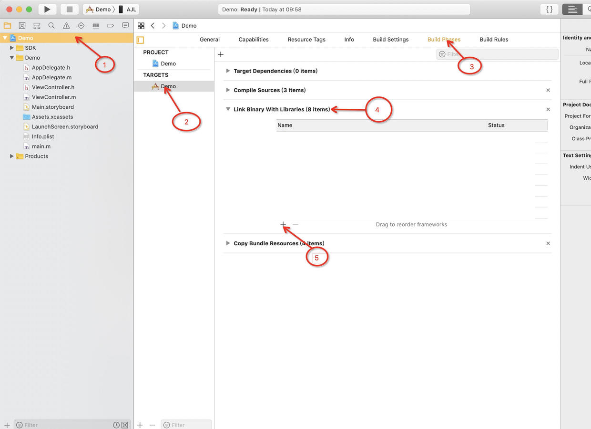
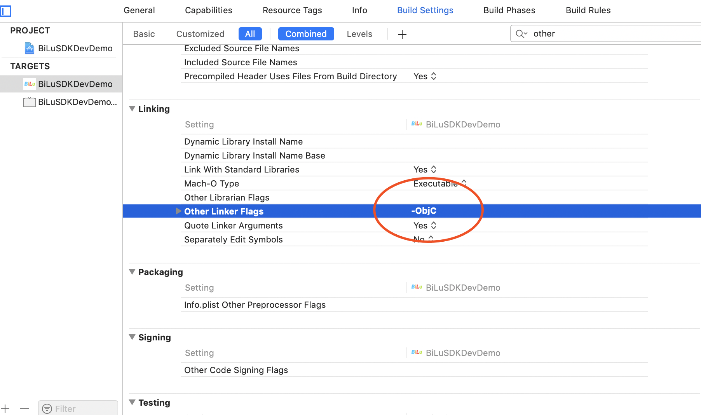
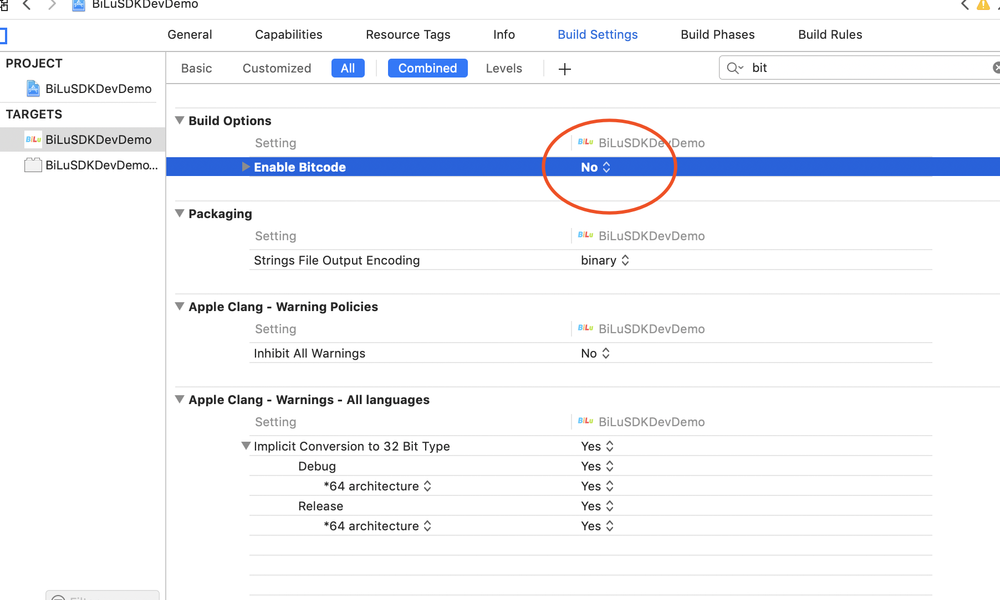
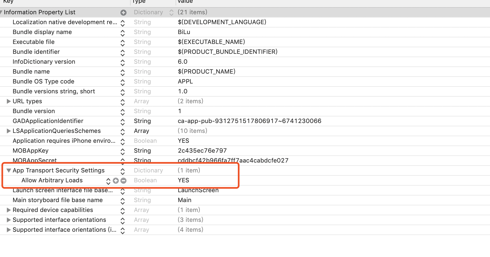
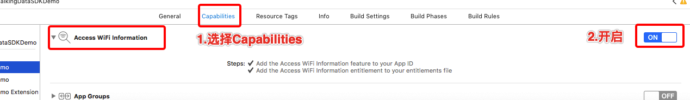

# **iOS集成BiLuSDK 内购充值版**

* [1、简介](#1、简介)
  * 1.1 [支持用户系统](#1.1、支持用户系统)
* [2、配置](#2、配置)
  * 2.1 [基础配置](#2.1、基础配置)
  * 2.2 [导入基础核心框架](#2.2、导入基础核心框架)
  * 2.3 [导入BiLuSDK和第三方的支持SDK](#2.3、导入BiLuSDK和第三方的支持SDK)
  * 2.4 [配置 Build Settings 和 Info.plist](#2.4、配置&nbsp;Build&nbsp;Settings&nbsp;和&nbsp;Info.plist)
  * 2.5 [初始化SDK](#2.5、初始化SDK)
  * 2.6 [带用户系统的初始化SDK](#2.6、带用户系统的初始化SDK)
* [3、基础-追踪玩家充值](#3、基础-追踪玩家充值)
  * 3.1 [用途和用法](#3.1、用途和用法)
  * 3.2 [接口及参数](#3.2、接口及参数)
* [4、高级-自定义事件](#4、高级-自定义事件)
  * 4.1 [用途和用法](#4.1、用途和用法)
  * 4.2 [接口及参数](#4.2、接口及参数)
* [5、内购IAP二次验证](#5、内购IAP二次验证)
  * 5.1 [用途和用法](#5.1、用途和用法)
  * 5.2 [接口及参数](#5.2、接口及参数)
  * 5.3 [服务器验证](#5.3、服务器验证)

## 1、简介
本文档介绍如何去集成iOS端的BiLuSDK（后面简称为SDK），包括获取开发者账号，获取AppID和AppKey并创建配置支持追踪玩家充值和自定义事件监控。
### 1.1、支持用户系统
BiLuSDK支持Game Center 和游客模式 生成用户系统。

## 2、配置 
### 2.1、基础配置
	Xcode10版本及以上。
	Target iOS 9.0及以上。

### 2.2、导入基础核心框架
核心模块包含以下框架和资源包文件，只需将它们拖放到Xcode中。

- BiLuSDKIAP.framework

**注:** 由于**BiLuSDK**暂时不支持cocoapod

### 2.3、导入BiLuSDK和第三方的支持SDK

|第三方平台|需要导入的包|**BiLu**支持的版本|参考网址|备注|    
|---|---|---|---|---|   
|---|---|---|---|---|

**注:** 导入SDK和系统支持库操作

- WebKit.framework
- CoreTelephony.framework
- SystemConfiguration.framework
- AdSupport.framework
- CoreMotion.framework
- CoreLocation.framework  
- QuartzCore.framework
- libc++.tbd
- libz.tbd

### 2.4、配置 Build Settings 和 Info.plist

1) 在 Xcode中, 点击到 **Build Settings**, 搜索 **Other Linker Flags** 然后添加 **-ObjC**(这里的字母O和字母C**需要大写**), 注意 **Linker Flags** 是区分大小写的:

2) 在 Xcode中, 点击到 **Build Settings**, 搜索 **Enable Bitcode** 设置为NO

3) 在您app的Info.plist中添加 **App Transport Security Settings** - **NSAllowsArbitraryLoads** 设置为YES

4) iOS 12.0 及以上系统获取 WiFi 的信息时，需要打开 **Access WiFi Information** 选项（Xcode 10.0 以上有此选项）

5) 设置权限
- Privacy - Location When In Use Usage Description
- Privacy - Location Always and When In Use Usage Description
- Privacy - Location Always Usage Description
- Privacy - Location Usage Description

### 2.5、初始化SDK

您需要在**AppDelegate**的**application:didFinishLaunchingWithOptions:**方法里面初始化**BiLuSDK**(必须在请求广告之前去初始化SDK)：

<pre><code>
- (BOOL)application:(UIApplication *)application didFinishLaunchingWithOptions:(NSDictionary *)launchOptions {
	
    BiLuConfiguration *configuration = [BiLuConfiguration configuration];
    configuration.sdkType = @"Unity";
    [BiLuSDKManager registerWithAppID:@"哔噜AppId" appKey:@"哔噜AppKey" configuration:configuration];

    return YES;
}</code></pre>

### 2.6、带用户系统的初始化SDK

您需要在**AppDelegate**的**application:didFinishLaunchingWithOptions:**方法里面初始化**BiLuSDK**(必须在请求广告之前去初始化SDK)：

<pre><code>
- (BOOL)application:(UIApplication *)application didFinishLaunchingWithOptions:(NSDictionary *)launchOptions {
	
    BiLuConfiguration *configuration = [BiLuConfiguration configuration];
    [BiLuSDKManager registerWithAppID:@"哔噜AppId" appKey:@"哔噜AppKey" configuration:configuration block:^(BiLuPlayer * _Nonnull player, NSError * _Nonnull error) {

    }];

    return YES;
}</code></pre>

## 3、基础-追踪玩家充值

### 3.1、用途和用法
玩家充值接口用于统计玩家充值现金而获得虚拟币的行为，充入的现金将反映至游戏收入中。
充值过程分两个阶段：

1、发出有效的充值请求；

2、确认某次充值请求已完成充值。

集成SDK时，在玩家发起充值请求时（例如玩家选择了某个充值包，进入支付流程那一刻）调用 onChargeRequest，并传入该笔交易的唯一订单ID和详细信息；在确认玩家支付成功时调用 onChargeSuccess，并告知所完成的订单ID。

*注意事项：*

1、orderID 是标识交易的关键，每一次的充值请求都需要是不同的 orderID，否则会被认为重复数据而丢弃，造成收入数据偏差的情况。如果多次充值成功的orderID重复，将只计算首次成功的数据，其他数据会认为重复数据丢弃。

2、orderID 由您自己构造和管理，可以使用类似 userID+时间戳+随机数的方式来自己定义 orderID，来保障其唯一性。

3、收入数据以调用了 onChargeSuccess 为准，Success 调用时的 orderID 要与 Request 中 orderID 对应，才可追溯到交易内容，有效计量。Request 必须调用，且需要早于 Success，否则可能影响收入数据的金额计数。

4、由于客户端网络不稳定，数据发送会存在不稳定情况。为了准确记录充值数据，我们专门提供了“收入数据服务器接口”来解决此问题。

### 3.2、接口及参数

接口：(BiLuVirtualCurrency 类)

    //记录付费点
    + (void)onChargeRequst:(NSString *)orderId iapId(NSString *)iapId currencyAmount:(double)currencyAmount currencyType:(NSString *)currencyType virtualCurrencyAmount:(double)virtualCurrencyAmount paymentType:(NSString *)paymentType;`
    //记录付费点成功
    + (void)onChargeSuccess:(NSString *)orderId;

|参数|类型|描述|
|---|---|---|
|orderId	|NSString	|订单 ID，最多 64 个字符。用于唯一标识一次交易。如果多次充值成功的 orderID 重复，将只计算首次成功的数据，其他数据会认为重复数据丢弃。如果 Success 调用时传入的 orderID 在之前 Request 没有对应 orderID，则只记录充值次数，但不会有收入金额体现。
|iapId	|NSString	|充值包 ID，最多 32 个字符。 唯一标识一类充值包。例如：VIP3 礼包、500 元 10000 宝石包
|currencyAmount	|double	|现金金额或现金等价物的额度
|currencyType	|NSString	|请使用国际标准组织 ISO4217 中规范的 3 位字母代码标记货币类型。例：人民币 CNY；美元 USD；欧元 EUR；如果您使用其他自定义等价物作为现金，亦可使用 ISO4217 中没有的3位字母组合传入货币型，我们会在报表页面中提供汇率设定功能
|virtualCurrencyAmount	|double	|虚拟币金额
|paymentType	|NSString	|支付的途径，最多 16 个字符。例如：“支付宝”、“苹果官方”、“XX 支付 SDK
）

## 4、高级-自定义事件

### 4.1、用途和用法
自定义事件用于统计任何您期望去追踪的数据，如：点击某功能按钮、填写某个输入框、触发了某个广告等。 开发者可以自行定义eventId，在游戏中需要追踪的位置进行调用，注意eventId中仅限使用中英文字符、数字和下划线，不要加空格或其他的转义字符。 除了可以统计某自定义eventId的触发次数，还可以通过key-value参数来对当时触发事件时的属性进行描述。如定义 eventId 为玩家死亡事件，可通过 key-value 添加死亡时关卡、死亡时等级、死亡时携带金币等属性。 每款游戏可定义最多10000个不同eventId，每个eventId下，可以支持100种 不同 key 的 1000种不同 value 取值(NSString 类型)，但是每次事件发生时最多只能同时附带 50 种不同 key。

### 4.2、接口及参数
接口： 在游戏程序的event事件中加入下面格式的代码，也就成功的添加了一个简单的事件到您的游戏程序中了：

    [BiLuEvent onbiLuEvent:@"event_id" eventData:your_dictionary];

参数：

|参数|类型|描述|
|---|---|---|
|eventId	|NSString	|自定义事件名称，最多支持 32 个字符。仅限使用中英文字符、数字和下划线，不要加空格或其他的转义字符|
|key	|NSString	|自定义事件参数名称，最多支持 32 个字符|
|NSDictionary	|NSString NSNumber | key 类型必须是 NSString，一次事件最多只支持 50 个参数。如果 value 为 NSString，Game Analytics 会统计每种 value 出现的次数；如果为 NSNumber 类型，那么 Game  Analytics 会统计 value 的总和|

## 5、内购IAP二次验证

### 5.1、用途和用法

IAP二次验证，封装了测试：https://sandbox.itunes.apple.com/verifyReceipt
已上线Appstore：https://buy.itunes.apple.com/verifyReceipt 接口，采用服务器验证方式。调用完内购支付完即可调用此方法验证是否支付完成。

### 5.2、接口及参数

接口：(BiLuVirtualCurrency 类)

     /// AppStore 内购IAP二次验证
    /// @param response 二次验证 返回block
    + (void)appStoreReceipt:(void (^)(NSDictionary *json , NSError * error))response;

### 5.3、服务器验证

[服务器IAP内购二次验证说明](Server_auth.md)
